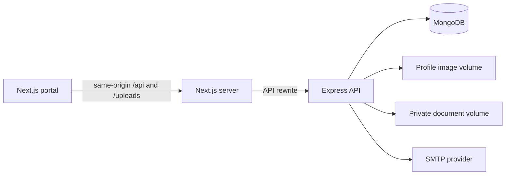

# Architecture and access model

## System shape

The browser authenticates with an HTTP-only cookie. Next.js proxies API requests to Express, which validates the session, role, resource ownership, and request schema before calling the service and repository layers. Passwords and reset tokens are never returned to clients.

## Backend layers

- Routes define authentication and broad role requirements.
- Controllers validate input and format the shared API response envelope.
- Services enforce workflow and record-level access rules and emit notifications.
- Repositories isolate MongoDB queries.
- Models enforce database shapes and indexes.

Private documents are stored outside the public directory. Downloads pass through an authenticated controller that checks the document owner or administrator role. Only profile images are served from the public upload path.

## Roles

| Capability | Student | Counsellor | Administrator |
|---|---:|---:|---:|
| Manage own profile and onboarding | Yes | Account profile | Account profile |
| View university and scholarship catalogue | Yes | Yes | Yes |
| Receive profile-based recommendations | Yes | No | No |
| Create applications | Own | No | Administrative oversight |
| Manage application progress | Own draft actions | Assigned cases | All cases |
| Upload/read documents | Own | No | All and verify |
| Book appointments | Own | Assigned schedule | All schedules |
| Start messages | Counsellors | Assigned students | All users |
| Track visa cases | Own | Assigned cases | All and reassign |
| Manage users/catalogue/analytics | No | No | Yes |

The backend is the authority for access decisions. Frontend role guards and navigation improve usability but are not treated as security controls.

## Authentication lifecycle

1. Registration hashes the password with bcrypt.
2. Login verifies credentials and sets a secure HTTP-only cookie containing a signed session-versioned JWT.
3. Protected requests validate the JWT and current session version.
4. Password changes and password resets increment the session version, invalidating old sessions.
5. Forgot-password responses are deliberately identical for known and unknown addresses. Reset tokens are random, stored only as hashes, expire, and can be used once.

## Workflow notifications

Application updates, appointments, document verification, messages, and visa changes create persisted notifications. The portal refreshes notifications periodically and when the window regains focus. Message notifications link directly to their conversation.
